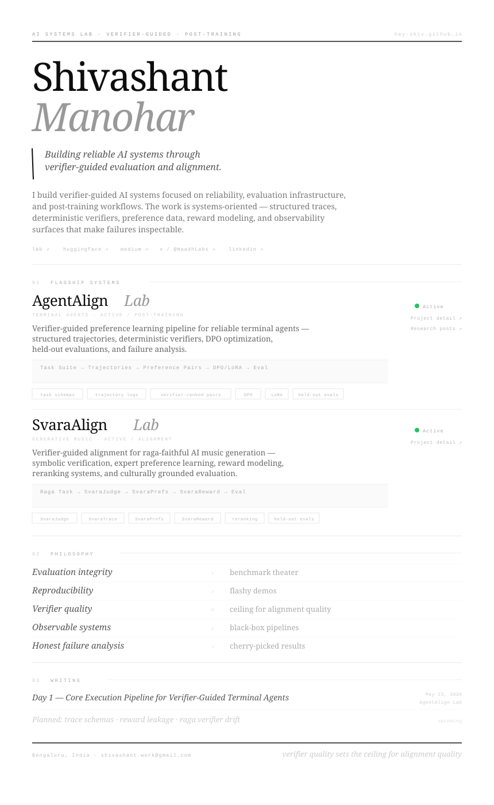

<!-- Links overlay — these are the clickable versions of what's in the SVG -->

[lab](https://hey-shiv.github.io) &nbsp;·&nbsp;
[huggingface](https://huggingface.co/hey-shiv) &nbsp;·&nbsp;
[medium](https://medium.com/@shivashant.personal) &nbsp;·&nbsp;
[x / @NaadhLabs](https://x.com/NaadhLabs) &nbsp;·&nbsp;
[linkedin](https://linkedin.com/in/shivashant)

---

<!-- Clickable project links -->
**Labs:** &nbsp;
[AgentAlign Lab ↗](https://hey-shiv.github.io/projects/agentalign-lab/) &nbsp;·&nbsp;
[SvaraAlign Lab ↗](https://hey-shiv.github.io/projects/svaraalign-lab/) &nbsp;·&nbsp;
[Writing ↗](https://hey-shiv.github.io/blog.html)
