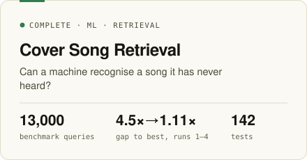
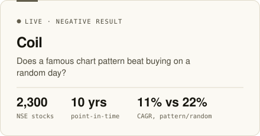
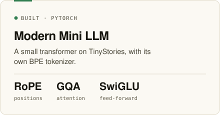
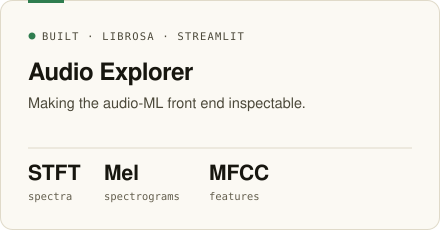

<a href="https://hey-shiv.github.io"><picture><source media="(prefers-color-scheme: dark)" srcset="assets/banner-dark.svg"></picture></a>

 

<a href="https://hey-shiv.github.io"><kbd>&nbsp;site&nbsp;</kbd></a>&nbsp;
<a href="https://linkedin.com/in/shivashant"><kbd>&nbsp;linkedin&nbsp;</kbd></a>&nbsp;
<a href="https://x.com/hey_shivv"><kbd>&nbsp;x&nbsp;</kbd></a>&nbsp;
<a href="https://medium.com/@shivashant.personal"><kbd>&nbsp;medium&nbsp;</kbd></a>&nbsp;
<a href="mailto:shivashant.work@gmail.com"><kbd>&nbsp;email&nbsp;</kbd></a>

  

A builder becoming an engineer. I build things end to end, then measure them honestly, including when the answer is no.

  

<a href="https://hey-shiv.github.io/projects/cover-song-retrieval/"><picture><source media="(prefers-color-scheme: dark)" srcset="assets/cover-dark.svg"></picture></a>&nbsp;<a href="https://hey-shiv.github.io/projects/vcp-screener/"><picture><source media="(prefers-color-scheme: dark)" srcset="assets/coil-dark.svg"></picture></a>
<a href="https://github.com/hey-shiv/mini-modern-llm"><picture><source media="(prefers-color-scheme: dark)" srcset="assets/llm-dark.svg"></picture></a>&nbsp;<a href="https://github.com/hey-shiv/Audio-Explorer"><picture><source media="(prefers-color-scheme: dark)" srcset="assets/audio-dark.svg"></picture></a>

<a href="https://hey-shiv.github.io"><picture><source media="(prefers-color-scheme: dark)" srcset="assets/now-dark.svg"></picture></a>

  

<code>Python</code> <code>SQL</code> <code>C++</code> <code>pandas</code> <code>NumPy</code> <code>PyTorch</code> <code>scikit-learn</code> <code>librosa</code> <code>FastAPI</code> <code>Streamlit</code> <code>Git</code> <code>Linux</code>

